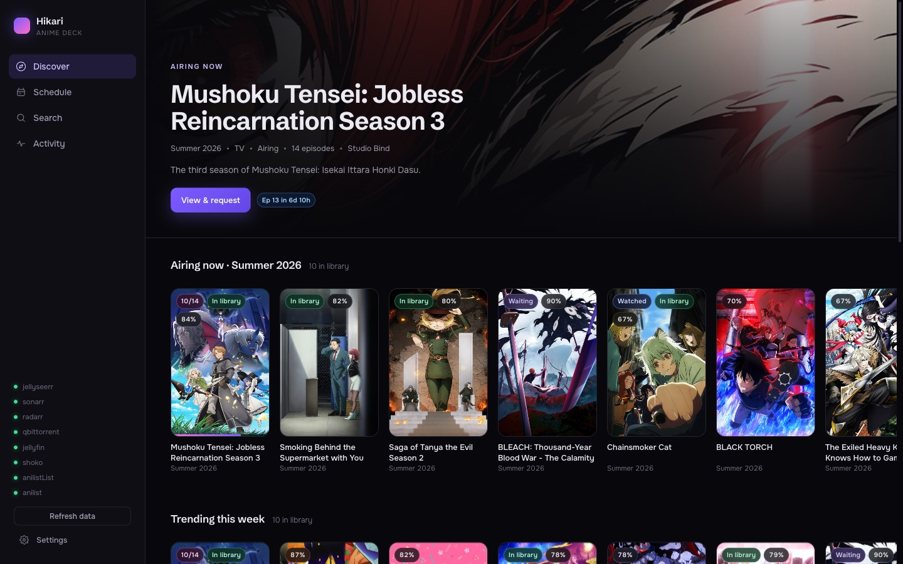
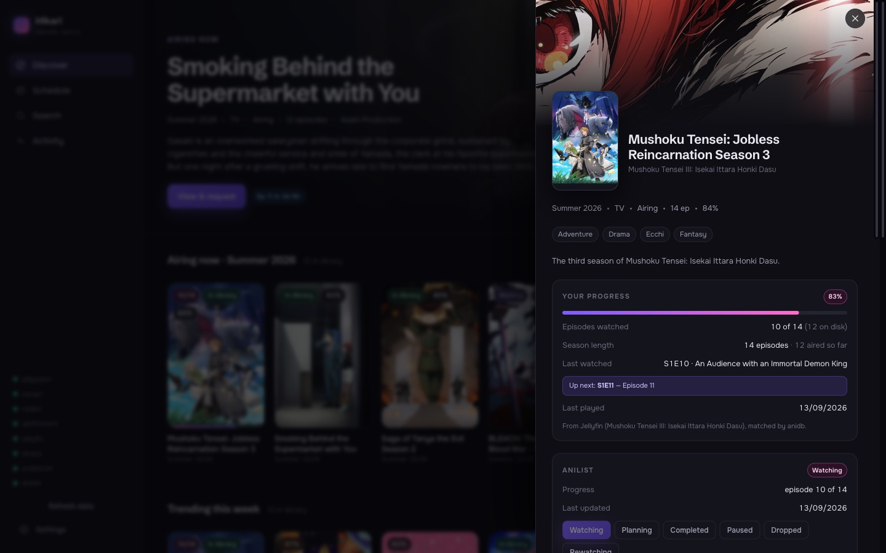
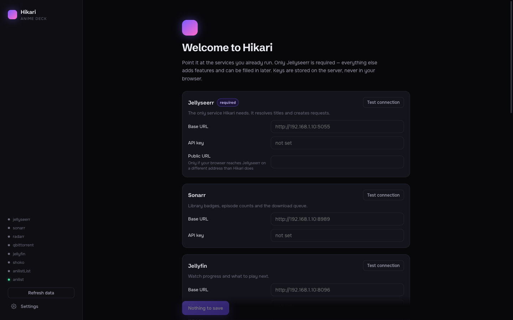
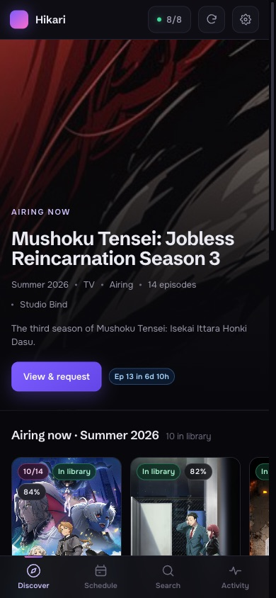

<h1 align="center">Hikari</h1>

<p align="center">
  
  
  
  
</p>

<p align="center">
  A seasonal anime deck for a self-hosted stack. It shows what is airing, what you already own and
  how far through each show you are, then requests the rest through <b>Jellyseerr</b>. It reads
  <b>Sonarr</b>, <b>Radarr</b>, <b>Jellyfin</b>, <b>Shoko</b> and <b>qBittorrent</b> for the truth
  about your library.
</p>

## Current Features

- Discover what is airing this season, trending, coming next and the all-time top, every card badged from your real library
- An airing schedule for the next 3, 7 or 14 days, filterable to just the shows you follow
- Watch progress from Jellyfin: episodes watched, what is up next, and how many have aired but are not downloaded
- Requests through Jellyseerr with the correct season worked out for you, and duplicates made impossible
- Anime quality profile and root folder applied explicitly, because TMDB's anime keyword is missing on plenty of anime
- Detects a series Sonarr added as `standard` and fixes it to `anime` in one click
- True episode counts from AniDB through Shoko, including which episodes are genuinely missing
- Repairs the two things that habitually break: files AniDB never matched, and Jellyfin watch history orphaned by a Shokofin rebuild
- AniList list status and episode progress, editable, off by default
- Setup entirely in the browser, with no configuration file needed and a connection test per service
- Built for a phone as well as a desk: bottom tab bar, bottom sheets, no horizontal scrolling
- A `customapi` endpoint for [Homepage](https://gethomepage.dev)

Missing something? Open an [issue](/../../issues).

## Getting Started

```bash
docker compose up -d --build
```

Open `http://localhost:7997` and the app walks you through pointing it at your services. Only
Jellyseerr is required. Full instructions: [docs/getting-started.md](docs/getting-started.md).

## Preview





<p>
  
  
</p>

## Documentation

- [Getting started](docs/getting-started.md): install, the prebuilt image, running alongside an existing stack
- [Configuration](docs/configuration.md): every setting and where values come from
- [Requesting](docs/requesting.md): how a season is chosen and duplicates prevented
- [Library and links](docs/library.md): what "missing" really means, Shoko repair, title matching
- [Security](docs/security.md): the threat model and `HIKARI_TOKEN`
- [API](docs/api.md) and [Homepage widget](docs/homepage-widget.md)
- [Troubleshooting](docs/troubleshooting.md)

## Support

Questions and bugs belong in the [issue tracker](/../../issues). Hikari talks to a lot of moving
parts, so say which services are red in the sidebar and what the detail panel reports it matched by.

## Built with

Solid 2, Vite 8 and Hono on Node 22. No database. All state lives in the services it talks to.
